<div align="center">

### 🌐 &nbsp; [**웹사이트 바로가기 — Live Demo 👉 클릭**](https://frontend-eight-beryl-27.vercel.app/) &nbsp; 🌐

[](https://frontend-eight-beryl-27.vercel.app/)


# 🪑 스터디 오아시스 (Study Oasis)

<h3>키오스크 하나로 좌석 선택·결제·연장·퇴실까지<br/>무인 스터디카페 통합 관리 시스템</h3>


</div>

<br/>

## ⌨️ 개발 기간

- **2026.03.05 ~ 2026.06.12 (약 14주)**
- 소프트웨어공학 | 국립한국교통대학교 컴퓨터공학과 | 2026-1학기

<a name="tableContents"></a>

<br/>

## 🔎 목차

1. <a href="#subject">🎯 프로젝트 소개</a>
1. <a href="#mainContents">⭐️ 주요 기능</a>
1. <a href="#architecture">⚙️ 시스템 아키텍처</a>
1. <a href="#skills">🛠️ 기술 스택</a>
1. <a href="#erd">💾 ERD</a>
1. <a href="#kiosk">🖥️ 화면 소개 — 키오스크</a>
1. <a href="#admin">🖥️ 화면 소개 — 관리자</a>
1. <a href="#structure">📁 프로젝트 구조</a>
1. <a href="#run">🚀 실행 방법</a>

<br/>

<!------- 프로젝트 소개 -------->

## 🎯 프로젝트 소개

<a name="subject"></a>

무인화·24시간 운영 수요가 커지는 스터디카페 환경에 맞춘 **무인 좌석 예약 시스템**입니다.

이용자는 터치스크린 키오스크 하나로 **좌석 선택 → 결제 → 연장 → 자리 이동 → 퇴실** 전 과정을 직원 없이 처리하고, 관리자는 별도 웹 대시보드에서 **실시간 좌석 현황·매출 통계·오류 로그**를 모니터링합니다.

| 항목 | 내용 |
|------|------|
| 프로젝트명 | 스터디 오아시스 — 무인 스터디카페 좌석 예약 시스템 |
| 개발 형태 | 키오스크(440×880px) + 관리자 웹 대시보드 |
| 좌석 규모 | 전체 100석 (일반 / 프리미엄 / 1인실) |
| 데이터 | In-memory (Node.js 프로세스 메모리, 재시작 시 초기화) |

<div align="right"><a href="#tableContents">목차로 이동</a></div>

<br/>

<!------- 주요 기능 -------->

## ⭐️ 주요 기능

<a name="mainContents"></a>

### 🎫 키오스크 — 이용자

- **좌석 조회 · 선택** : 100석 실시간 상태(가능/사용중/예약/점검) 그리드, 유형별 필터
- **결제 처리** : 카드 · 현금 · 카카오페이 · 토스페이 · 네이버페이 5종 UI, PG 시뮬레이션 연동
- **시간 연장 · 자리 이동** : 이용 중 1·2·4·6시간 추가 결제, 빈 좌석으로 이전
- **이용 현황 조회 · 퇴실** : 좌석 번호로 잔여 시간·금액 확인 후 퇴실 처리

---

### 🧑‍💼 관리자 — 대시보드

- **KPI 모니터링** : 전체/이용가능/이용중 좌석 수, 오늘 매출 실시간 집계
- **실시간 좌석 현황** : WebSocket 기반 좌석 상태 즉시 반영, 슈퍼관리자 강제 초기화
- **매출 통계** : 일별(7일)·주별(5주)·월별(6개월) 이용 건수·매출 차트
- **운영 관리** : 이용 기록, 오류 로그(심각도 필터), 공지사항 등록·고정

---

### ⚙️ 시스템 공통

- **실시간 동기화** : Socket.IO `seat:update` 이벤트로 상태 변경 즉시 전파
- **예약 자동 취소** : 결제 대기 180초 경과 시 자동 취소 및 좌석 반환
- **유휴 타임아웃** : 키오스크 3분 무활동 시 홈 화면 자동 복귀
- **서버 감시 · 오프라인 폴백** : 10초 주기 헬스체크, 미연결 시 mock 데이터 fallback

<div align="right"><a href="#tableContents">목차로 이동</a></div>

<br/>

<!------- 시스템 아키텍처 -------->

## ⚙️ 시스템 아키텍처

<a name="architecture"></a>

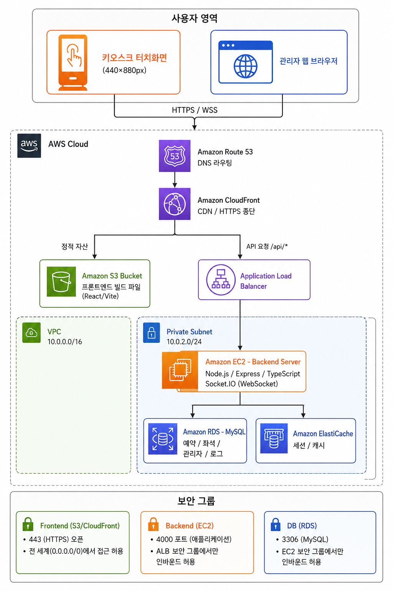

프론트엔드(React/Vite)와 백엔드(Express/Node.js) 두 서버로 구성된 모놀리식 구조이며, 동일한 프론트엔드 번들에서 URL 경로(`/kiosk`, `/admin`)로 분기합니다.

- **REST API** (HTTP/JSON) : 예약·결제·관리자 조회 등 요청-응답
- **WebSocket** (Socket.IO) : 좌석 상태 실시간 브로드캐스트
- **Heartbeat** (HTTP) : 10초 주기 `/api/health` 폴링으로 서버 상태 감시

<div align="right"><a href="#tableContents">목차로 이동</a></div>

<br/>

<!------- 기술 스택 -------->

## 🛠️ 기술 스택

<a name="skills"></a>

### Frontend


---

### Backend


---

### 인증 · 보안

- **인증** : JWT(HS256, 8시간 만료) + bcrypt(cost 12) + TOTP 2차 인증
- **접근 제어** : RBAC 3단계 — `USER` / `ROLE_ADMIN` / `ROLE_SUPERADMIN`
- **계정 보호** : 로그인 5회 실패 시 계정 잠금, 401 응답 시 자동 로그아웃

<div align="right"><a href="#tableContents">목차로 이동</a></div>

<br/>

<!------- ERD -------->

## 💾 ERD

<a name="erd"></a>

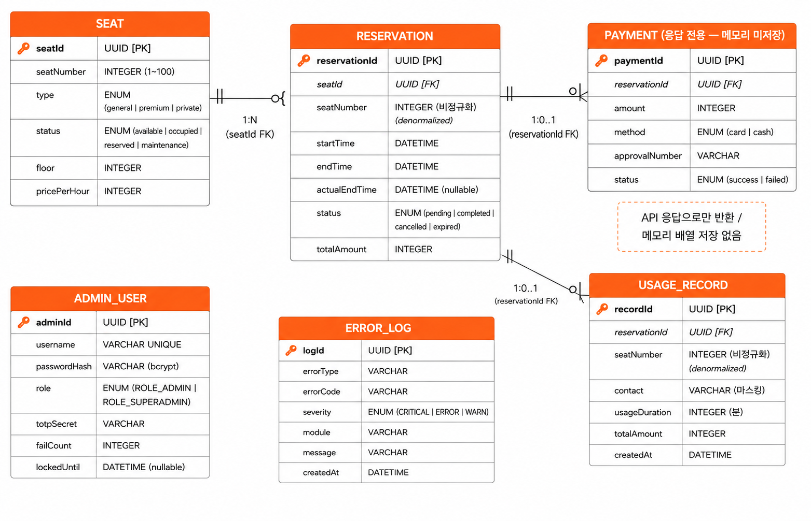

주요 엔티티 — `Seat`(좌석 100개) · `Reservation`(예약) · `Payment`(결제) · `AdminUser`(관리자) · `ErrorLog`(오류 로그) · `UsageRecord`(이용 기록)

<div align="right"><a href="#tableContents">목차로 이동</a></div>

<br/>

<!------- 화면 소개 키오스크 -------->

## 🖥️ 화면 소개 — 키오스크

<a name="kiosk"></a>

<table>
  <tr>
    <td align="center" width="25%"><h5>진입 화면</h5>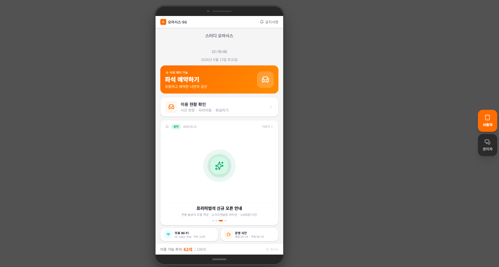</td>
    <td align="center" width="25%"><h5>홈 (좌석 현황)</h5>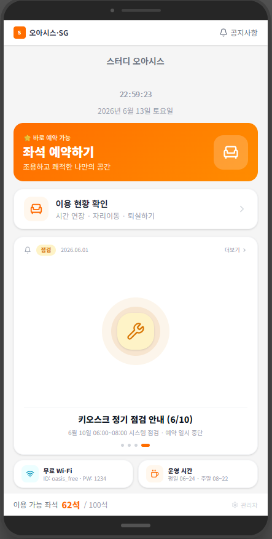</td>
    <td align="center" width="25%"><h5>좌석 선택</h5>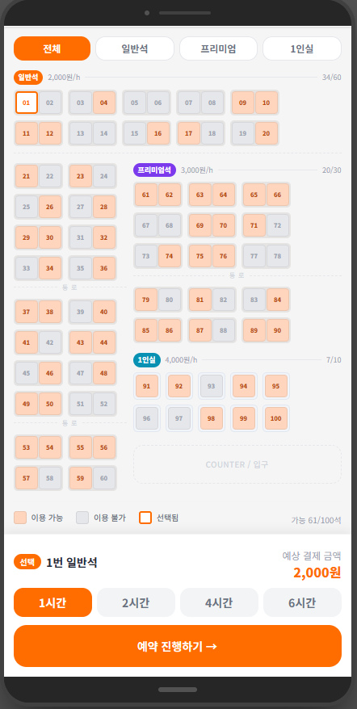</td>
    <td align="center" width="25%"><h5>결제 / 시간 선택</h5>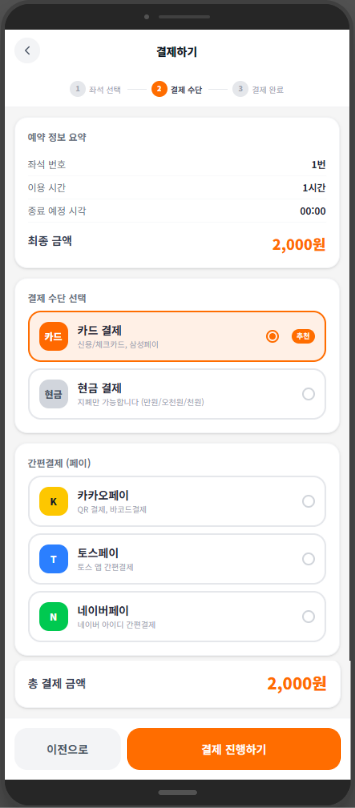</td>
  </tr>
  <tr>
    <td align="center"><h5>결제 완료</h5>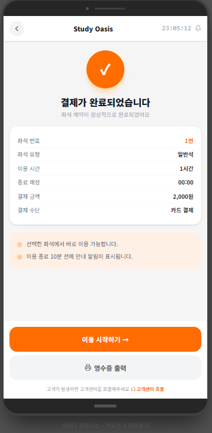</td>
    <td align="center"><h5>이용 현황</h5>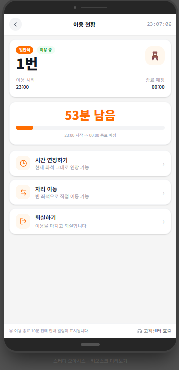</td>
    <td align="center"><h5>시간 연장</h5>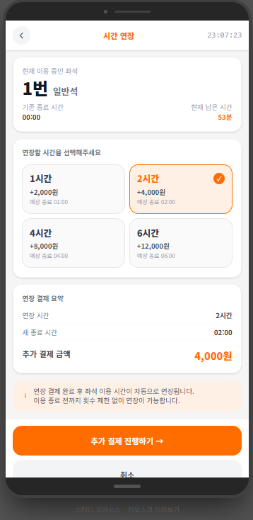</td>
    <td align="center"><h5>자리 이동</h5>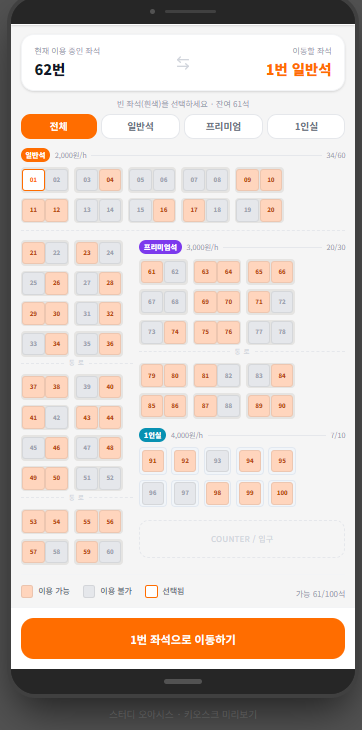</td>
  </tr>
</table>

<div align="right"><a href="#tableContents">목차로 이동</a></div>

<br/>

<!------- 화면 소개 관리자 -------->

## 🖥️ 화면 소개 — 관리자

<a name="admin"></a>

<table>
  <tr>
    <td align="center" width="50%"><h5>관리자 로그인 (2FA)</h5>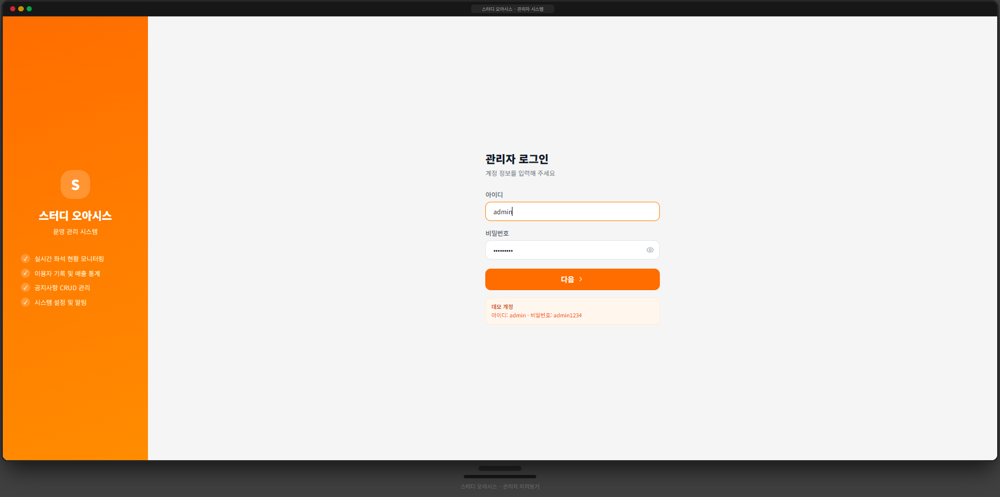</td>
    <td align="center" width="50%"><h5>대시보드 (KPI · 좌석 현황)</h5>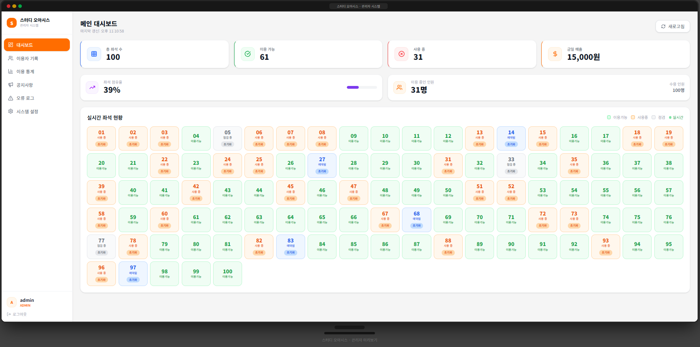</td>
  </tr>
  <tr>
    <td align="center"><h5>이용 기록</h5>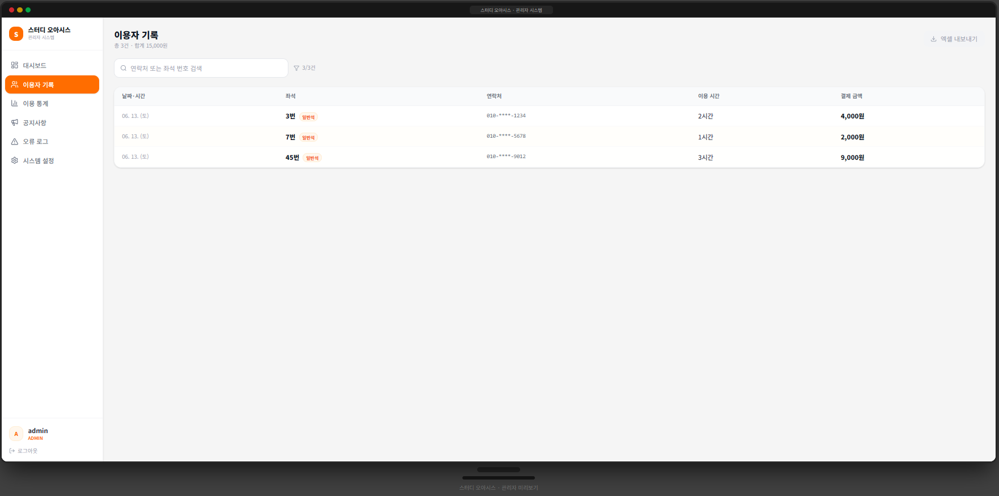</td>
    <td align="center"><h5>매출 통계</h5>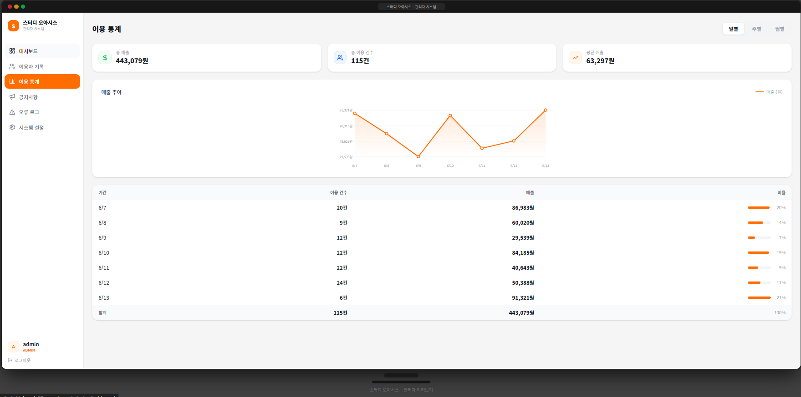</td>
  </tr>
  <tr>
    <td align="center"><h5>공지사항 관리</h5>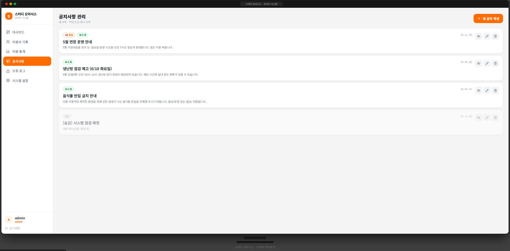</td>
    <td align="center"><h5>오류 로그</h5>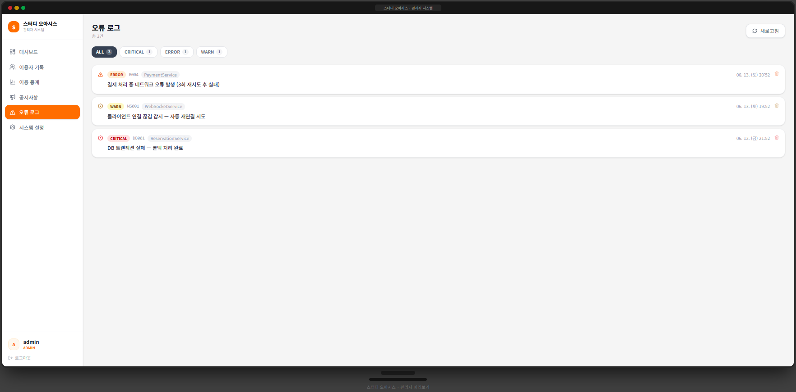</td>
  </tr>
</table>

<div align="right"><a href="#tableContents">목차로 이동</a></div>

<br/>

<!------- 프로젝트 구조 -------->

## 📁 프로젝트 구조

<a name="structure"></a>

```
study-cafe-reservation/
├── frontend/     # 키오스크 UI + 관리자 대시보드 (React 19 + Vite)
│   └── src/
│       ├── pages/        # 화면 컴포넌트 (키오스크 / 관리자)
│       ├── stores/       # Zustand 전역 상태 (seat, auth, reservation)
│       ├── api/          # Axios 클라이언트 + 인터셉터
│       └── hooks/        # useWebSocket, useIdleTimeout 등
│
├── backend/      # REST API + WebSocket 서버 (Node.js + Express)
│   └── src/
│       ├── routes/       # URL 패턴 · 미들웨어 체인
│       ├── controllers/  # 비즈니스 로직
│       ├── middleware/   # JWT · 권한 검증
│       └── data/         # In-memory 데이터 (mockData.ts)
│
└── docs/         # 기획 · 설계 문서 (SRS, 아키텍처, ERD, 화면 설계)
```

<div align="right"><a href="#tableContents">목차로 이동</a></div>

<br/>

<!------- 실행 방법 -------->

## 🚀 실행 방법

<a name="run"></a>

```bash
# 1. 백엔드 (포트 4000)
cd backend
npm install
npm run dev

# 2. 프론트엔드 (포트 3000)
cd frontend
npm install
npm run dev
```

**데모 계정** — 관리자: `admin` / `admin1234` / OTP `000000`

<div align="right"><a href="#tableContents">목차로 이동</a></div>

<br/>

---

<div align="center">

**스터디 오아시스** · 소프트웨어공학 프로젝트 · 국립한국교통대학교 2026-1학기

</div>
